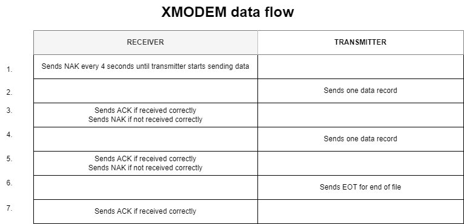

# Nakuja Flight Computer Simulation Engine
Nakuja Flight Computer Simulation Engine

### Desktop application 

The desktop application built with Qt with C++. The main function of the app is to visualize the data coming from the flight computer. Using this data, we can get the thought process of the flight computer, helping us to debug the flight software in real-time. 

The desktop app is made up of the following major parts:

1. Simulation Parameter Selection
2. Serial Monitor
3. State Machine Viewer
4. System Diagnostics
5. Data Visualization 
6. Flight State Viewer
7.  Ejection Stages Selection 

These subsystems are described below:

### 1. Simulation Parameter and Serial Port Selection


This subsystem is responsible for setting how you want the simulation to take place. Here, the user can select Port connected to the hardware interface, the baud rate, simulation file and the time step.

#### plug-and-play

This part is implemented in such a way that it auto-detects any serial device connected to the device (**Plug-and-play**). After every 5 seconds, it rescans the serial ports and updates the port list. Here you can select the baud rate depending on the MCU you have connected to your computer. 

#### simulation file

In the simulation file selection part, you select the  simulation file that you have generated based on the HIL models from MatLab. Also, this file can come from the previous flight data files. Note that this data MUST be in csv file. 

#### time-step

The time-step selection simulates the frequency at which you want the data from the flight computer to be received and/or displayed. Select a higher time-step to "slow-down" the algorithm and vice versa. This time-step is in milliseconds.


To better understand this part of the simulation engine, the block diagram is presented below: 


### 2. State Machine Viewer

### 3. System Diagnostics 

### 4. Data Visualization

### 5. Flight State Viewer

### 6. Ejection Stages Selection


## Data exchange protocol
The data exchange protocol used is borrowed from the XMODEM protocol. In this project, we do not implement error detection and correction. 

### XMODEM details 
XMODEM is a data exchange protocol for sending and receiving data with error detection and correction. If an error is detected in the given message packet, the receiver requests a re-transmission of the packet. There are no special characters sent in the data stream. Each transmission consists of a header packet, data bytes and a trailer byte for error checking. 

The transmission message looks like below:

``` <SOH><BLK#><255-BLK#><---128 DATA BYTES---><CHECKSUM> ```

Where:


|Character|Description|
|---|----|
|SOH|01 HEX start of the packet|
|BLK#|Binary number starts from 01 incremenets by 1 to 0|
|255-BLK#|1's complement of BLK#|
|128 DATA BYTES|Data packet|
|CHECKSUM|2 bytes CRC16|

Transmission and reception modes are set to 8 bits no parity automatically. 

#### ASCII commands interpretation
|Command|HEX|Description|
|---|---|---|
|SOH|01|Start of Heading|
|ACK|06|Positive acknowledge|
|NAK|15|Negative acknowledge|
|CAN|18|Cancel|
|EOT|04|End of transmission|


### Data flow
XMODEM is receiver-driven protocol. The receiver initiates the protocol and controls the flow of data with a control character to indicate correct or incorrect reception of data record. 

The XMODEM process begins with the receiver sending a NAK (Not acknowledge) for checksum mode or a 'C' for CRC16 mode. If the transmitter does not acknowledge after the receiver has sent 3 'C' characters, it switches to checksum mode and sends a NAK command. If the transmitter receives a NAK, it re-transmits the the previous data block. If it receives an ACK, it sends the next data block. 

After the last message has been sent (EOF), the receiver will be looking for another SOH to start the next data packet. The transmitter will send an EOT(0x04) to signify the end of file. The receiver will ACK the EOT as the final step. 




### Installation 

#### Windows
***BEWARE: UNTESTED***
1. Download this repo as a zip file 
2. Unzip the repo into a new directory
3. In the ```install folder```, double click on ```nafcse.exe```
#### Linux
```coming soon```
#### MacOS
```coming soon```

### How to run tests and integration

Follow the procedure below to run flight software and hardware integration tests using this engine.

#### On the flight computer 
1. Connect the flight computer using a USB cable to your PC. NOTE: DO NOT CONNECT THE BATTERY OR PYROS.
2. On the flight computer, move the header pin jumper from the RUN mode to TEST mode as shown in the image below: (INSERT IMAGE HERE)
3. The RED LED should turn ON to indicate TESTING MODE. The buzzer will buzz twice in successive fashion to indicate change of state. In this mode, the flight computer is waiting for test flight data from the UART0 channel. 
4. Open the NAFCSE APP on your PC (check the installation steps above on how to install).
5. Select the simulation file on the 

### References
1. https://www.advsofteng.com/doc/cdcppdoc/realtimedemoqt.htm
2. https://web.mit.edu/6.121/www/other/pcplot_man/pcplot14.htm
3. https://www.linkedin.com/pulse/doxygen-santosh-s-malagi/
4. https://embeddedinventor.com/guide-to-configure-doxygen-to-document-c-source-code-for-beginners/
4. https://randomnerdtutorials.com/esp32-pinout-reference-gpios/