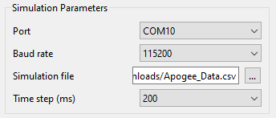

# Nakuja Flight Computer Simulation Engine
Nakuja Flight Computer Simulation Engine

### Desktop application  documentation

The desktop application built with Qt with C++. The main function of the app is to visualize the data coming from the flight computer. Using this data, we can get the thought process of the flight computer, helping us to debug the flight software in real-time. 

The desktop app is made up of the following major parts:

1. Simulation Parameter Selection
2. Serial Monitor
3. State Machine Viewer
4. System Diagnostics
5. Data Visualization 
6. Flight State Viewer
7.  Ejection Stages Selection 

These subsystems are described below:

### 1. Simulation Parameter and Serial Port Selection

This subsystem is responsible for setting how you want the simulation to take place. Here, the user can select Port connected to the hardware interface, the baud rate, simulation file and the time step.

#### plug-and-play

This part is implemented in such a way that it auto-detects any serial device connected to the device (**Plug-and-play**). After every 5 seconds, it rescans the serial ports and updates the port list. Here you can select the baud rate depending on the MCU you have connected to your computer. 

#### simulation file

In the simulation file selection part, you select the  simulation file that you have generated based on the HIL models from MatLab. Also, this file can come from the previous flight data files. Note that this data MUST be in csv file. 

#### time-step

The time-step selection simulates the frequency at which you want the data from the flight computer to be received and/or displayed. Select a higher time-step to "slow-down" the algorithm and vice versa. This time-step is in milliseconds.

To better understand this part of the simulation engine, the block diagram is presented below: 

### 2. State Machine Viewer

### 3. System Diagnostics 

### 4. Data Visualization

### 5. Flight State Viewer

### 6. Ejection Stages Selection

### References
1. https://www.advsofteng.com/doc/cdcppdoc/realtimedemoqt.htm